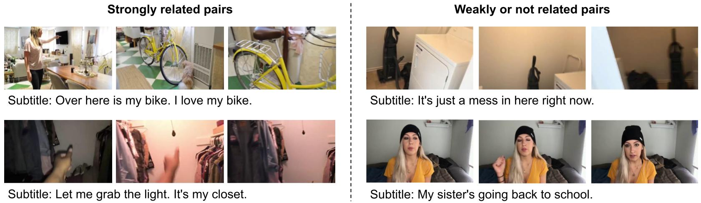

# Watch and Learn: Mapping Language and Noisy Real-world Videos with Self-supervision


Code for downloading the **ApartmenTour dataset**, used in [Watch and Learn: Mapping Language and Noisy Real-world Videos with Self-supervision](https://arxiv.org/abs/2011.09634)




## Requirements
```shell
pytube
youtube-dl 
webvtt
codecs
```
Note: for youtube-dl, see [youtube-dl](https://github.com/ytdl-org/youtube-dl) for installation


## Training set

The training set contains 577 videos with subtitles. The videos and subtitles can be downloaded and preprocessed  using the following commands.


- Download subtitles
```shell
python main_subtitle.py data/url/url_paper.txt
```

- Obtain the list of videos that provide subtitles
```shell
cd data/subtitle
find -type f > list_subtitle.txt
cd ../..
python subtitle2vid.py
```

- Download videos
```shell
python main_video.py data/url/url.txt
```


- Cut subtitles 
```shell
python process_subtitle.py
```

- Build the video-subtitle pairs as training data
```shell
python build_pairs.py
```


## Test set

This test set contains 100 clip-sentence pairs, which is used in the paper for the bidirectional retrieval evaluation. The frames and subtitles are provided below.

- Frames are available [here](https://drive.google.com/file/d/1ZtGcdsjUNTnKFqhNw-FOFbkHvrEDoNtU/view?usp=sharing) (27M) 
- Subtitles are avaiable [here](https://drive.google.com/file/d/1HAXexDFM7NnCDUvxtNs718I-xXBnDylo/view?usp=sharing)


## Frame-level features
The frame-level features extracted using an ImageNet-pretrained ResNet-50 is coming soon. 
Note: downloading the videos is recommanded, as then you will not be restricted by the network type, data augmentations and frame rate etc.


## Citations
Please consider citing our paper if the project helps your research. BibTeX reference is as follows. 
```
@article{zhong2020watch, 
  title={Watch and Learn: Mapping Language and Noisy Real-world Videos with Self-supervision}, 
  author={Zhong, Yujie and Xie, Linhai and Wang, Sen and Specia, Lucia and Miao, Yishu}, 
  journal={arXiv preprint arXiv:2011.09634}, 
  year={2020} 
}
```

